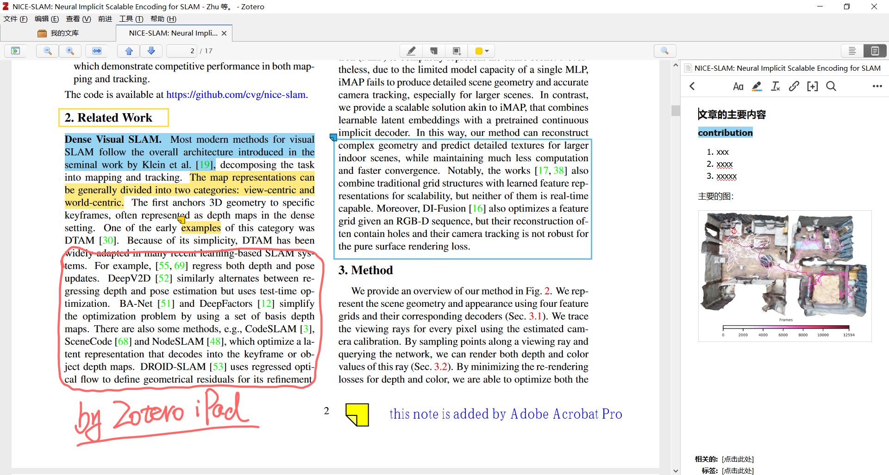

# 文献管理工具Zotero配置（使用坚果云同步）

## Why Zotero?

* 跨平台，支持Windows, Ubuntu, Mac and iPad
* 文献整理功能强大，使用collection(分类),item(条目)管理，并可以对item添加tag，非常实用！
* 笔记多样性，支持单独文字、图片笔记以及文本中的标记等，iPad端支持圈画！
* 支持使用外部PDF阅读器，Adobe PDF用户的福音！
* **支持同步非PDF文件**，例如ppt(**可以用来写文献总结等**)
* 免费，使用**坚果云**就能满足绝大多数用户需求，且*同步速度很快，无需翻墙！*
* 扩展灵活，有很多useful的插件，比如zotfile，支持各种各样的玩法

A demo of notes from different devices

## 安装

* [install in Ubuntu](./ubuntu20_setup_notes.md)
* 其他平台上的安装应该很简单，故不赘述

## 基础设置

`编辑`->`首选项`->`常规`：
* 禁用`使用父类元数据自动命名附件文件`：文件命名全部交给zotfile，下文会提到
* 禁用`使用关键字和标题自动给条目添加标签`：生成太多无关标签了

## 使用坚果云进行文献同步！

`编辑`->`首选项`->`同步`：
* 注册并登录[zotero账号](https://www.zotero.org/user/register)
* 禁用`自动同步`： 手动同步更方便
* 接下来参考[坚果云官方教程](https://help.jianguoyun.com/?p=3168)即可

## 重要插件安装

* Chrome浏览器插件：`工具`->`安装浏览器插件`，再按chrome的提示安装即可
* Zotfile：[下载地址](http://zotfile.com/#how-to-install--set-up-zotfile) ，[安装参考](https://blog.51cto.com/u_15127674/4564212)。 安装之后要重启zotero

## Zotfile配置与使用

Zotfile的作用是自动修改pdf文件名字和*自动管理pdf文件夹*

* 基础设置： `工具`->`Zotfile preferences`-> `Renaming Rules`: 根据自己的需要，微调设置。或者直接使用默认设置
* 使用： 鼠标点击改名字的item(条目)，点击鼠标右键，选择`Manage Attachments`->`Rename and Move`

## 添加文献的方法

* 从chrome直接导入：使用浏览器插件
* 从本地直接拖放

## 分类文献的一些建议

* 建议按研究方向建立collection(分类)，再将文献(即item/条目)放入对应的collection中
* 按需要，给item(条目)打上不同的tag, 比如`IMPORTANT`, `to_read`, `RAL2022_relativeWorks`. 再根据tag快速搜索出要找的item

## 关于PDF阅读器的选择

可以使用zotero阅读PDF文献，功能已经很不错了;也可以使用外部PDF阅读器(比如Windows的Adobe Acrobat Pro).
* 如何设置： `编辑`->`首选项`->`常规`->`打开PDF使用`
两种阅读器的不同：
* zotero: 所做的笔记会写入专用的笔记文件中，不会修改PDF文件
* 外部阅读器：直接修改PDF文件

## 同步非PDF文件

有时候，我们需要对某个研究方向写总结，通常得到ppt,markdown等非PDF文件。方便起见，通常需要将这些文件和文献放在一块。方法：
* 直接将非PDF文件拖入对应的collection(分类)下，再点击同步即可
* 双击该非PDF文件，zotero会使用系统默认软件打开它

**至此，已经能满足绝大多数用户需要。如有问题，欢迎讨论~**

------------------------------------------------------------------------------------------

## *高级功能--使用iPad中的PDF Expert同步阅读文献（探索中）*

* zotero所有PDF和笔记都存在/PATH_to_Zotero/storage下，每一个item一个文件夹，以一串字母编号来命名该文件夹，文件夹下有PDF和文件笔记。**但这种文件管理方式不直观**
* 可以使用zotfile管理PDF文件夹，使其按collection(分类)目录管理PDF文件：
* 方法：`工具`->`Zotfile preferences`-> `General Settings` -> `Location of Files`:选择`Custom Location`,并指定相应的文件夹路径（记为Zotero_PDF_only）；选择`Use subfolder defined by`, 填入`/%c`
* 点击item，右键选择`Manage Attachments`->`Rename and Move`
* **注意**：经过这些操作后，storage下的PDF文件将会移动到Zotero_PDF_only中
* 软连接Zotero_PDF_only到storage中，**但似乎zotero无法同步这个软连接文件夹**
* 使用坚果云同步Zotero_PDF_only
* 使用iPad中的PDF Expert访问坚果云的Zotero_PDF_only文件夹，阅读且编辑PDF
* 初步测试，此方案只适合单电脑系统+iPad，例如Windows+iPad； 不适合在多电脑系统中使用(如Windows和Ubuntu)，因为两个系统中的Zotero_PDF_only文件路径写法不同

## Acknowledge

Thanks for the help from my friend([Jinghang](https://github.com/JinghangLi))